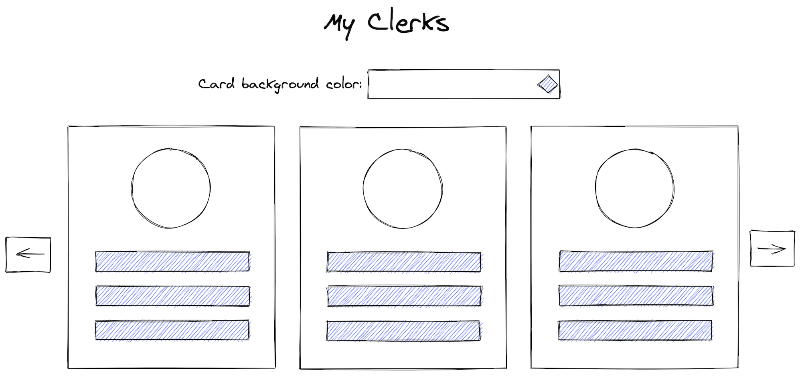

# 🎖️ Introduction

The purpose of this assignment is to evaluate the structure of the delivered application, the best practices you follow, along with your coding principles and skills.

# 📱 My Clerks application

As part of this assignment you will implement **My Clerks** application. **My Clerks** displays user profile cards in a nice, responsive and performant way. A wireframe for desktop screens can be found below.

## 📑 Requirements

- Browse through users and display their profile card. For each user display their `name`, `email`, `phone number`, `picture` and `location`.
- Fetch next page in the most performant and UX friendly way taking into account the current device. No animations are required but if you feel like adding some you are more than welcome.
- Fetch user data from [Randomuser.me API](https://randomuser.me/). Please note that each call to the API can [return one or many users at once](https://randomuser.me/documentation#results). Therefore, for the purpose of this assignment you need to find the most performant way to get your data and avoid fetching and displaying them all at once.
- Implement the background color selection of the user profile functionality. The selection should apply to all visible cards instantly and should persist upon full page reloads.
- Make the application **mobile first**. That is, you have to optimize for mobile devices. The arrows in the wireframe are optional and can be replaced by modern pagination techniques.
- Target **evergreen** browsers only. Don't worry, we won’t test it in IE 11 😌.
- Style the application to your liking.
- Include testing.
- You can use any popular frontend framework, or implement with vanilla js if you prefer. We’d prefer React, as this is what Clerk uses for our components and apps, but others like Vue.js, Angular, or Svelte are fine if this is your comfort zone.

## 🤷‍♂️ Ambiguity

There are parts of this assignment that are ambiguous, and this is on purpose. There is always ambiguity in real project requirements. We ask that you handle ambiguity in requirements as you would if you were working a normal job. So, if your approach is to make a decision about what you think the best result is and roll with that, go for it. If your approach is to discuss the ambiguity and collaborate with others to figure out the best direction, please use our shared slack channel for this purpose. If you have not yet had one set up, send me an email at `jeff@clerk.com` with the email address you would like us to send the invite to and we’ll get you in there.

Your working style and decisions in the face of ambiguous requirements is a part of the assignment, so do not change your normal behavior when faced with decisions like this just because it’s an assignment that’s part of an interview!

## 🔍 **The Review**

Please include a **README** file in the root directory of this repo with the necessary instructions and the points you'd like to highlight. It will help us during the review, where we'll look at:

- The project structure and architecture
- Good coding practices
- Performance
- Code styling and formatting
- Naming and conventions
- Visual styling
- Decisions around interactivity and behavior
- VC history

## ✉️ Submission

To submit the assessment, create a pull request from the `dev` branch into the `main` branch. Return to your assessment page and follow the Submission Process there to finalize your submission.
